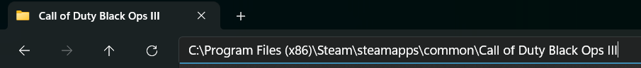
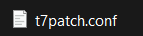
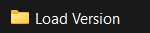
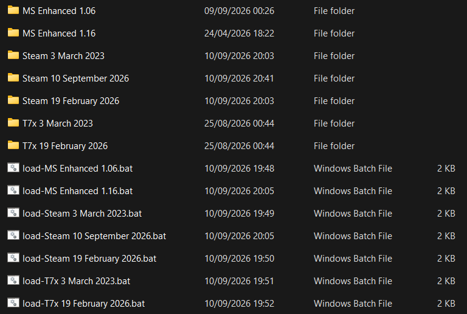
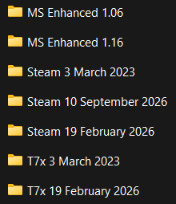
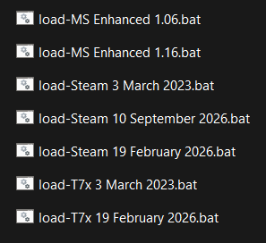

# Bo3 Load Version

Simple scripts to quickly switch between different Call of Duty: Black Ops 3 versions using `.bat` files. 
- **Bo3 Steam 19 February 2026 has spoofer, Thank you [Scroptss](https://github.com/Scroptss)!**
- **All Bo3 MS Enhanced versions, Bo3 Steam 3 march 2023 and Steam 19 February 2026 include T7 patch!**


## Installation

1. Download the files `Download.ps1` and `Run-Download.bat` from this repository.

    Click the links below to download the files:

    - [**Download.ps1**](https://github.com/Luisete2105/Bo3-Load-Version/releases/download/v1.0/Download.ps1)
    - [**Run-Download.bat**](https://github.com/Luisete2105/Bo3-Load-Version/releases/download/v1.0/Run-Download.bat)

2. Place both files **inside your Call of Duty: Black Ops 3 game folder**.

    

   **Default Steam installation path:**
   ```
   C:\Program Files (x86)\Steam\steamapps\common\Call of Duty Black Ops III
   ```

3. Double-click **`Run-Download.bat`**.

   This will automatically download the latest release and extract all the necessary files directly into the game folder (no extra subfolders).

> **Important:**  
> If double-clicking `Download.ps1` does nothing or shows an execution policy error, always use **`Run-Download.bat`**. It forces PowerShell to run the script correctly without changing your system settings.

---

## After Installation

Once the download and extraction finish, a file named **`t7patch.conf`** will appear in the root of your game folder.



Open it with Notepad (or any text editor). It should look like this:

```ini
playername=
isfriendsonly=1
networkpassword=
```

### Configuration explanation:

| Setting              | Description                                                                 |
|----------------------|-----------------------------------------------------------------------------|
| `playername=`        | Write the nickname you want to use in the game.                             |
| `isfriendsonly=1`    | `1` = Enable T7 Patch<br>`0` = Disable T7 Patch                             |
| `networkpassword=`   | Password required for you and your friends to join private matches when the T7 Patch is active. |

---

## How to use

After the files are extracted, open the Load Version folder.



Inside you will see all the folders with the file versions and its bat files.



You can manually copy and paste the files yourself if you want.



Or Simply run the corresponding `.bat` file for the version you want to play.
This will also delete the files that are not needed from other game versions.



---

## Credits

- **Idea**:
[Scrappy](https://github.com/Joshr520) For creating the original Load-Version to switch between MS 1.06 and Steam 19 February 2026
- **BO3 MS Store**:
[Serious](https://github.com/shiversoftdev) and [Emma](https://github.com/InvoxiPlayGames) For creating [Bo3 Enhanced](https://github.com/shiversoftdev/BO3Enhanced) mod.
- **T7 Patch**:
[Serious](https://github.com/shiversoftdev) and [Scroptss](https://github.com/Scroptss) For making Bo3 safe to play with [T7 patch](https://github.com/Scroptss/T7Patch).
```